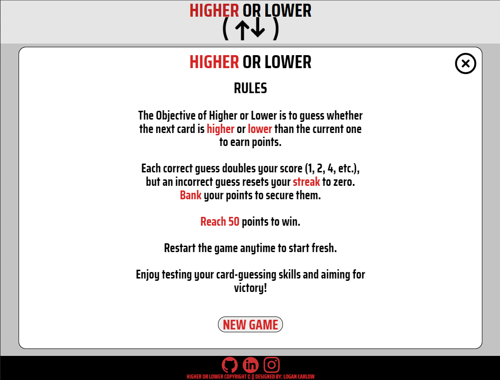

# Higher Or Lower


## Welcome to the Higher or Lower! 

This interactive web-based game challenges players to test their intuition and card-guessing skills. The objective is straightforward: accumulate 50 points by correctly guessing whether the next card will be higher or lower in value than the current card. The game features scoring, point banking, and a winner's page, making it an engaging and enjoyable experience for players of all ages. Have fun and see if you can reach the goal of 50 points!

Live Site : [Higher or Lower](https://terrabite147.github.io/higher-or-lower/)


## Features 

### Existing Features

- __Navigation Bar__

  - A simple navigation bar that displays the Higher or Lower Logo that acts as a link to the home page. 


- __The landing page image__

  - The landing includes the logo and options that allow the user to start the game, check the rules and report and issue. 
  - This section introduces the user to Higher or Lower with a simple and clear design.


- __The Game__
  
  - When a user clicks the new game button the screen will change to the game window.
  - In the center a card will be displayed and the user will be asked to guess if the next card will be higher or lower than the current card.
  - The goal of the game to to get to 50 points with the least amount of guesses.
  - Guessing correct will grant them a streak point, guessing multiple in a row will double the streak points. for example 1 correct guess will give 1 streak point, 2 correct will give 2, 3 correct will give 4 ect.
  - The user will always have the option to bank the points to secure them.
  - If the user guesses wrong the streak will reset back to 0 without the option to bank.
  - In the bottom left the banked points will be displayed.
  - In the bottom center the current streak points will be displayed.


- __Winner page__
  
  - When the user reaches 50 or more points the user will be greeted with a congratulations page.
  - The page will display how many points were banked and in how many turns.
  - An option to play a new game in present on the page.
  - If the user presses the X button in the top right the user will be redirected to the home page.
  


- __Rules__

  - When a user clicks the rules button the rules window will appear.
  - The rules of the game have be clearly explained.
  - An option to start a new game is present on the page so the user can imedatly start playing rather than going but to the home page.
  - If the user presses the X button in the top right the user will be redirected to the home page.



- __The Footer__ 

  - The footer section includes links to the relevant social media sites for Higher or Lower. The links will open to a new tab to allow easy navigation for the user. 
  - The footer also includes a disclaimer and credits.


- __Report and Issue__

  - This page will allow the user to send any issues they may have come across while playing the game.
  - The page includes a field for the user's name and email address and text box to describe the issue.


### Features Left to Implement

- A username to record previous scores.
- A leader board to compare the user's personal best with other users'

## __User Experience (UX)__

-   ### ***User stories***

    -   #### First Time Visitor Goals

        1. As a First Time Visitor, I want to easily understand the main purpose of the site and have fun playing the Card game.
        2. As a First Time Visitor, I want to be able to easily be able to navigate throughout the site to find content, including on how play the game. 
        3. As a First Time Visitor, I want to locate the site creator's social media links to see their following on social media to determine how trusted and known they are.

    -   #### Returning Visitor Goals

        - As a Returning Visitor I want to Attempt to beat the challenge in fewer guesses.
        - As a Returning Visitor, I want to get in contact with the site creator with any questions I may have about the site.

    -   #### Frequent User Goals
  
        - As a Frequent User, I want to try and beat my personal best score on the challenge.

  -   ### ***Design***
  -   #### Colour Scheme
      -   The three main colours used are black white and Red.
          -   Red
              -    was used for the buttons and the logo.
          -   White 
              -     was used for the background.
          -   Black 
              -    was used for the text and footer
  
      -   The colours were inspired by a [deck of cards](https://en.wikipedia.org/wiki/Playing_card#/media/File:AcetoFive.JPG).
      -   This colour scheme was used to keep the site simple and easy to use.
  -   #### Typography
  -   The [Saira Condensed](https://fonts.google.com/specimen/Saira+Condensed?query=saira) font is the main font used throughout the whole website with Sans Serif as the fallback font in case for any reason the font isn't being imported into the site correctly. Saira Condensed is a clean font used frequently in programming, so it is both attractive and appropriate.
  -   #### Imagery
  -   The card images used are designed to be simple and easily recognizable to the user.
  -   The higher or lower logo is a simple design that is easily recognizable and memorable.
## Testing 


### Validator Testing 

- HTML
  - [W3C validator](https://validator.w3.org/nu/?doc=https%3A%2F%2Fcode-institute-org.github.io%2Flove-running-2.0%2Findex.html)
- CSS
  - [(Jigsaw) validator](https://jigsaw.w3.org/css-validator/validator?uri=https%3A%2F%2Fvalidator.w3.org%2Fnu%2F%3Fdoc%3Dhttps%253A%252F%252Fcode-institute-org.github.io%252Flove-running-2.0%252Findex.html&profile=css3svg&usermedium=all&warning=1&vextwarning=&lang=en#css)

## __Technologies Used__

### ***Languages Used***

-   [HTML5](https://en.wikipedia.org/wiki/HTML5)

-   [CSS3](https://en.wikipedia.org/wiki/Cascading_Style_Sheets)

-   [JavaScript](https://en.wikipedia.org/wiki/JavaScript)

### ***Frameworks, Libraries & Programs Used***

1. [Google Fonts:](https://fonts.google.com/)
    - Google Fonts was used to import the Saira Condensed font into the style.css file which is used on all pages throughout the project.

2. [Font Awesome:](https://fontawesome.com/)
    - Font Awesome was used on all pages throughout the website to add icons for aesthetic and UX purposes.

3. [Git:](https://git-scm.com/)
    - Git was used for version control by utilizing the Gitpod terminal to commit to Git and Push to GitHub.

4. [GitHub:](https://github.com/)
    - GitHub is used to store the projects code after being pushed from Git.

5. [Figma:](https://www.figma.com/)
    - Figma was used to create the wireframes during the design process.

6. [Chrome DevTools:](https://developer.chrome.com/docs/devtools/)
    - Chrome DevTools was used to consistently check the site in terms of responsivity, performance, accessibility, best practice and SEO.

## __Deployment__

### ***GitHub Pages***

The project was deployed to GitHub Pages using the following steps:

1. Log in to GitHub and locate the [Higher or Lower GitHub Repository](https://github.com/TerraBite147/higher-or-lower)
2. At the top of the Repository, locate the "Settings" Button on the menu.
3. Scroll down the Settings page until you locate the "GitHub Pages" Section.
4. Under "Source", click the dropdown called "None" and select "Master Branch".
5. The page will automatically refresh.
6. Scroll back down through the page to locate the now published site [link](https://github.com/TerraBite147/higher-or-lower) in the "GitHub Pages" section.

### ***Forking the GitHub Repository***

By forking the GitHub Repository we make a copy of the original repository on our GitHub account to view and/or make changes without affecting the original repository by using the following steps:

1. Log in to GitHub and locate the [Higher or Lower GitHub Repository](https://github.com/TerraBite147/higher-or-lower)
2. At the top of the Repository (not top of page) just above the "Settings" Button on the menu, locate the "Fork" Button.
3. You should now have a copy of the original repository in your GitHub account.

### ***Making a Local Clone***

1. Log in to GitHub and locate the [Higher or Lower GitHub Repository](https://github.com/TerraBite147/higher-or-lower)
2. Under the repository name, click "Clone or download".
3. To clone the repository using HTTPS, under "Clone with HTTPS", copy the link.
4. Open Git Bash
5. Change the current working directory to the location where you want the cloned directory to be made.
6. Type `git clone`, and then paste the URL you copied in Step 3.

```
$ git clone https://github.com/TerraBite147/higher-or-lower
```

7. Press Enter. Your local clone will be created.

```
$ git clone https://github.com/TerraBite147/higher-or-lower
> Cloning into `CI-Clone`...
> remote: Counting objects: 10, done.
> remote: Compressing objects: 100% (8/8), done.
> remove: Total 10 (delta 1), reused 10 (delta 1)
> Unpacking objects: 100% (10/10), done.
```

Click [Here](https://help.github.com/en/github/creating-cloning-and-archiving-repositories/cloning-a-repository#cloning-a-repository-to-github-desktop) to retrieve pictures for some of the buttons and more detailed explanations of the above process.

## Credits 


### Content 

- Kevin Powell's youtube tutorial on dialog https://youtu.be/TAB_v6yBXIE?si=yBL_Eyxm_FZwzFfG

- The icons in the footer were taken from [Font Awesome](https://fontawesome.com/)

### Media

- [Logo](https://www.vecteezy.com/vector-art/8552552-up-down-arrows-icon-inside-the-circle-upward-downward-business-logo-two-way-arrow-symbol-vector-for-your-website-design-logo-app-ui-illustration-eps-10)
- [Cards](https://www.pngegg.com/en/png-nnrxg)
